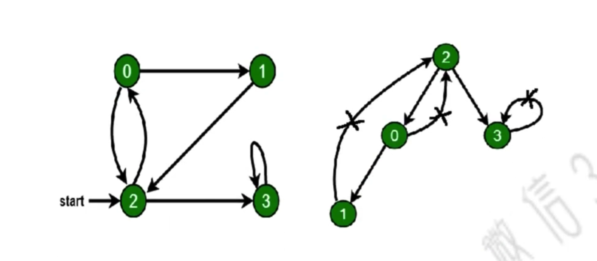
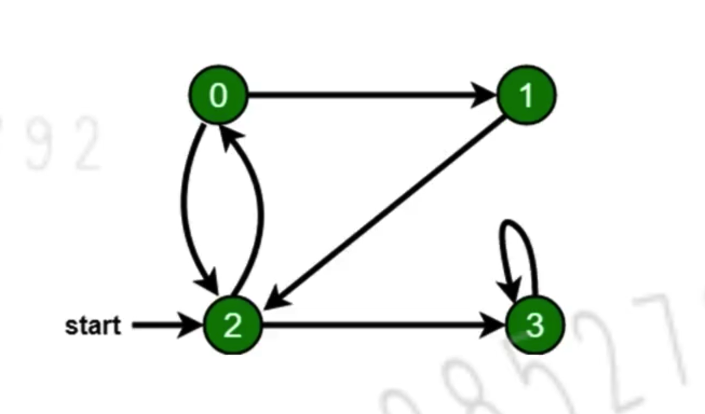

# 图（Graph）

## 介绍

- 图是`网络结构`的抽象模型，是一组由`边`连接的`节点`。
- 图可以表示任何二元关系，比如道路、航班......
- JS 中没有图，但是可以用 Object 和 Array 构建图

## 图的表示法：邻接表

<p align="center"></p>

## 遍历

### 深度优先遍历 - 尽可能深的搜索图的分支

- 访问根节点。
- 对根节点中`没访问过的相邻节点`依次进行深度优先遍历。

```typescript
const dfs = (
  graph: Graph,
  nodeKey: number,
  visitedNodeKey: Set<number> = new Set()
) => {
  console.log(nodeKey)
  visitedNodeKey.add(nodeKey)

  graph[nodeKey]?.forEach((nodeKey) => {
    if (!visitedNodeKey.has(nodeKey)) dfs(graph, nodeKey, visitedNodeKey)
  })
}
```

<p align="center"></p>

### 广度优先遍历 - 先访问离根节点最近的节点

- 新建一个队列，把根节点入队。
- 队头出队并访问。
- 队头中没有访问过的相邻节点入队。
- 重复第二、三步，直到队列为空。

```typescript
const dfs = (
  graph: Graph,
  nodeKey: number,
  visitedNodeKey: Set<number> = new Set()
) => {
  console.log(nodeKey)
  visitedNodeKey.add(nodeKey)

  graph[nodeKey]?.forEach((nodeKey) => {
    if (!visitedNodeKey.has(nodeKey)) dfs(graph, nodeKey, visitedNodeKey)
  })
}
```

<p align="center"></p>
