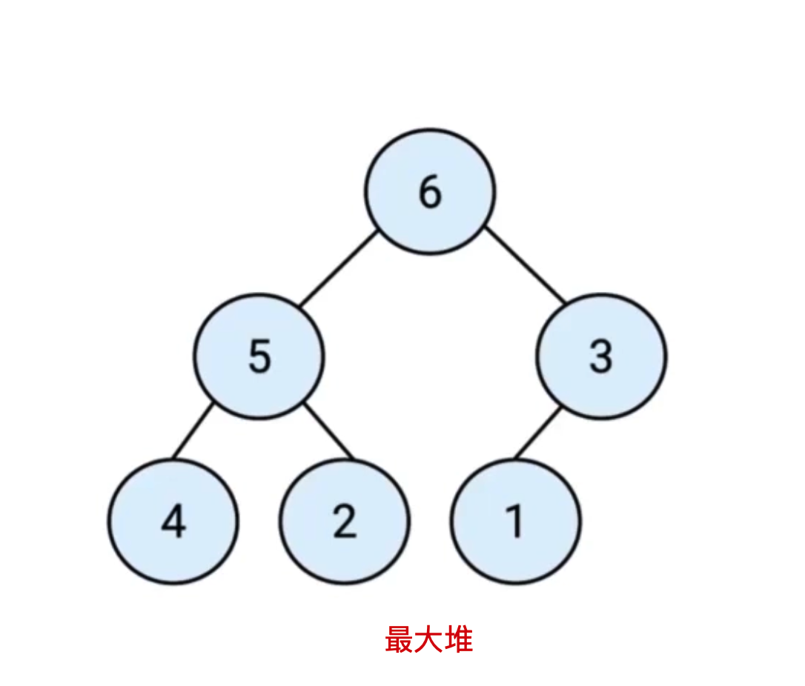
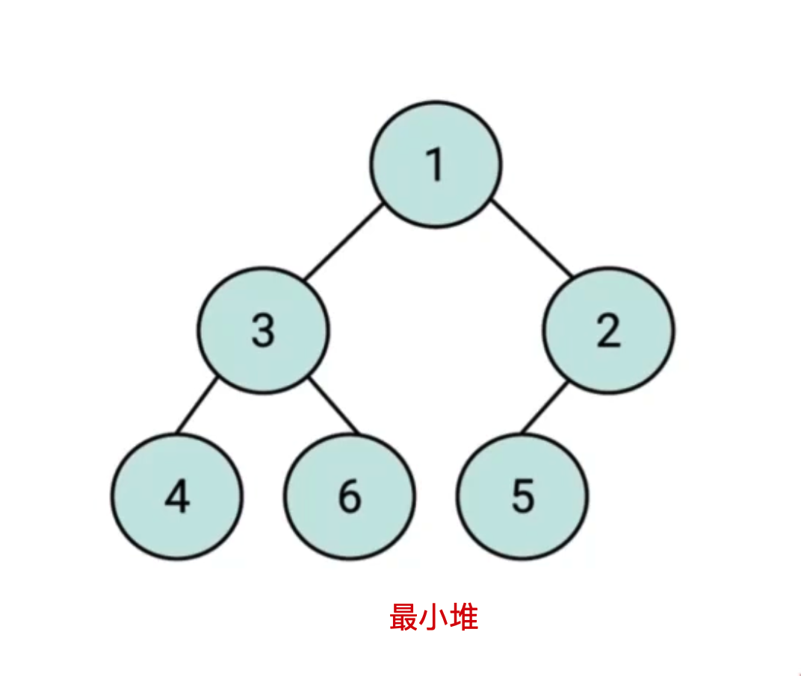
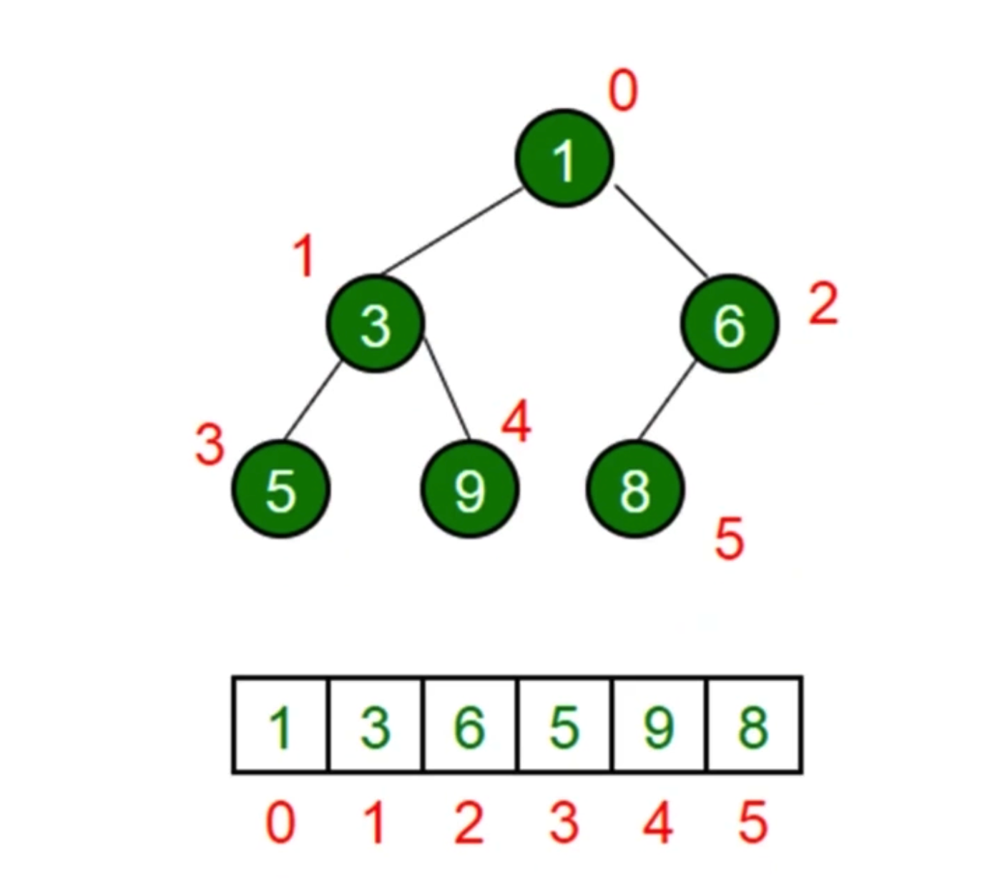

# 堆（Heap）

## 介绍

- 堆是一种特殊的`完全二叉树`。
- 所有的节点都大于等于（最大堆）或小于等于（最小堆）它的子节点。

> 完全二叉树：若设二叉树的深度为 h，除第 h 层外，其它各层(1~h-1）的结点数都达到最大个数，第 h 层所有的结点都连续集中在最左边。

  
  

## JS 中的堆

- JS 中通常用数组表示堆。
- 左侧子节点的位置是 2 \* index + 1 。
- 右侧子节点的位置是 2 \* index + 2 。
- 父节点的位置是 2 \* index + 2 。

