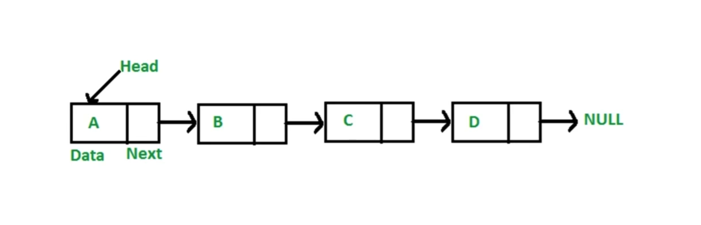

# 链表（linkedList）

## 介绍

- 多个元素组成的列表。
- 元素存储不连续，用`next`指针连在一起。
- JavaScript 中没有`链表`，可以用`Object`模拟`链表`。

### 数组 vs 链表

- 数组：增删非首尾元素时，需要移动元素。
- 链表：增删非首尾元素时，不需要移动元素，只需要修改元素`next`指向即可。

> JS 中的链表应用场景：原型链。

## 常用操作

- 修改`next`指向
- 遍历链表
