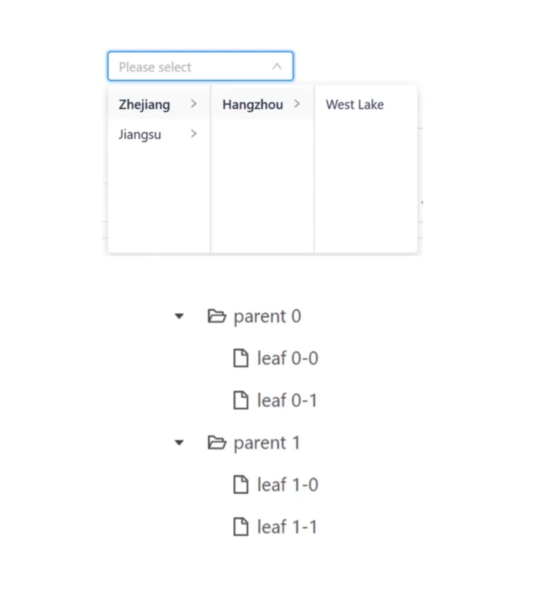
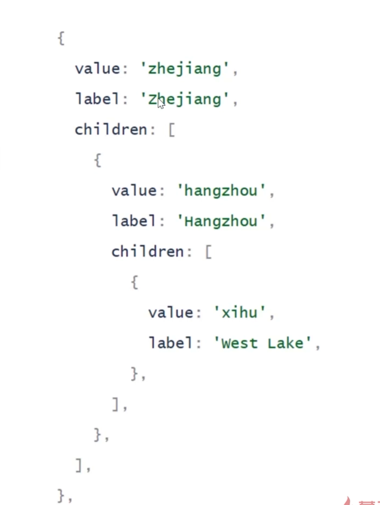
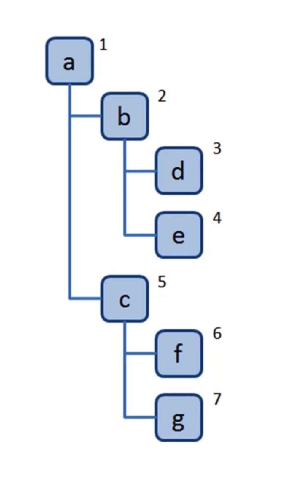
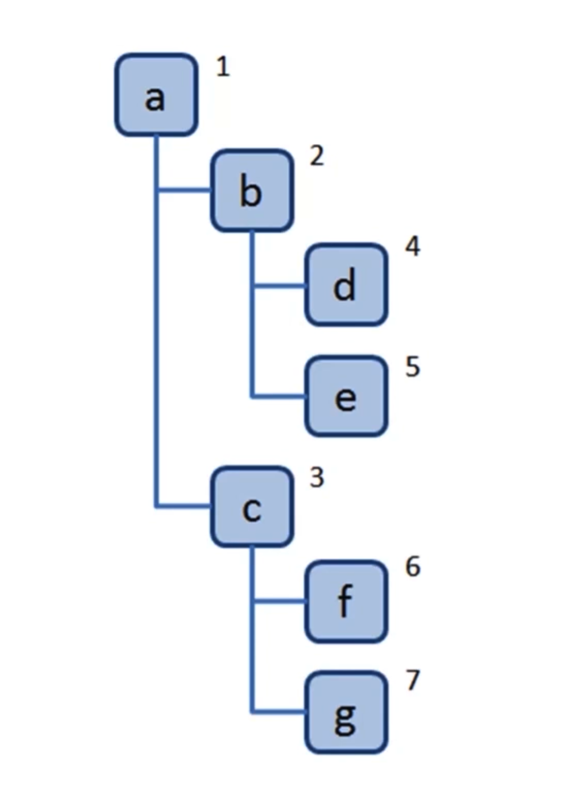
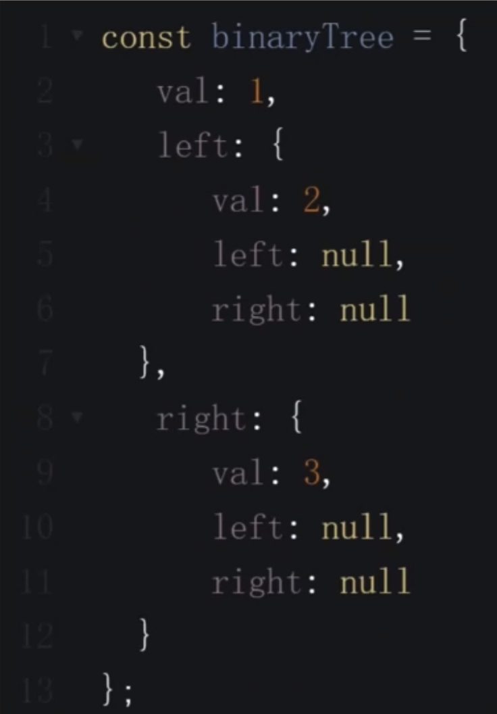
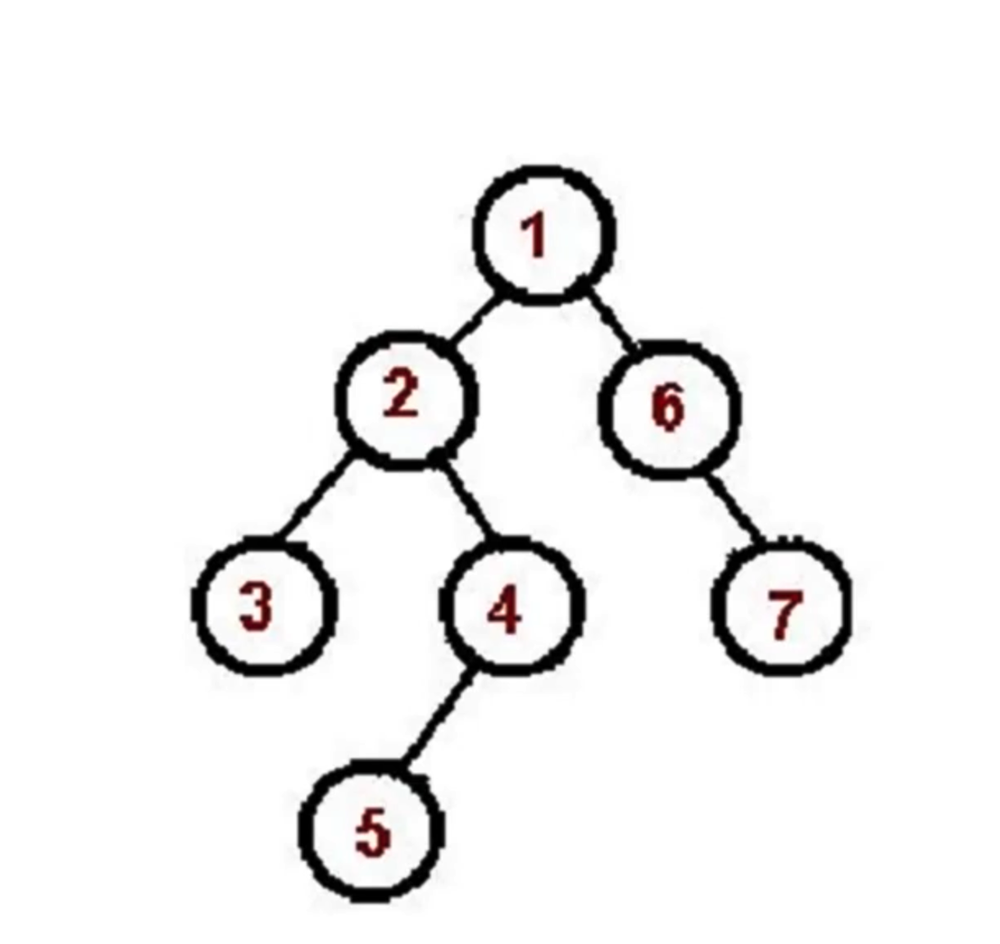
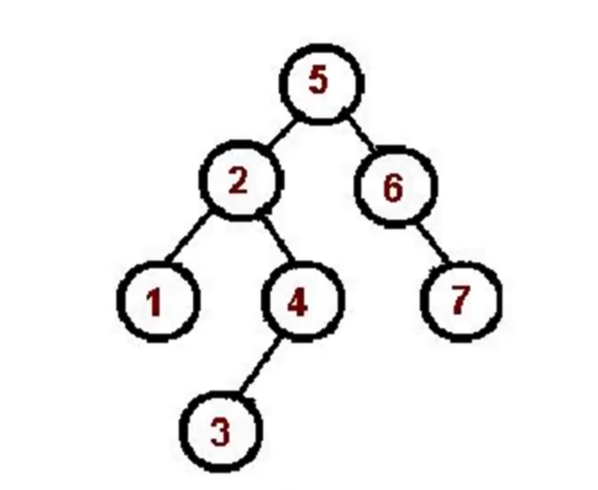
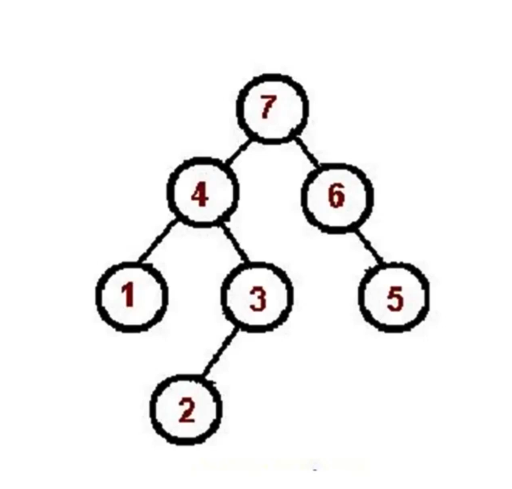

# 树（Tree）

## 介绍

- 一种`分层`数据的抽象模型。
- 前端工作中常见的树包括：DOM 树、级联选择、树形控件。
- JS 中没有树，但是可以用 Object 和 Array 构建树。
<p align="center">
	
	
</p>

## 遍历

### 深度优先遍历 - 尽可能深的搜索树的分支

- 先访问根节点。
- 对根节点的 children 依次进行深度优先遍历。

```typescript
const dfs = (tree: Tree) => {
  console.log(tree.value)
  tree.children.forEach((tree) => dfs(tree))
}
```

节点访问顺序如下：

<p align="center"></p>

### 广度优先遍历 - 先访问离根节点最近的节点。

- 新建一个队列，把根节点入队。
- 队头出队并访问。
- 依次遍历队头的 children，child 入队。
- 重复第二、三步，直到队列为空。

```typescript
const bfs = (tree: Tree) => {
  const queue = [tree]
  while (queue.length) {
    const item = queue.shift()!
    console.log(item.value)
    item.children.forEach((tree) => {
      queue.push(tree)
    })
  }
}
```

节点访问顺序如下：

<p align="center"></p>

## 二叉树

- 树中每个节点最多只能有两个子节点。
- 在 JS 中通常用 Object 来模拟二叉树。

<p align="center"></p>

### 遍历

#### 先序遍历

- 访问`根`节点
- 对根节点的`左`子树进行先序遍历
- 对根节点的`右`子树进行先序遍历

> 遍历顺序：根 -> 左 -> 右

<p align="center"></p>

```typescript
// 递归版本
const preorder = (tree: Tree) => {
  console.log(tree.value)
  if (tree.left) preorder(tree.left)
  if (tree.right) preorder(tree.right)
}

// 非递归版本
const preorder = (tree: Tree) => {
  const stack: Tree[] = [tree]

  while (stack.length) {
    const item = stack.pop()!
    console.log(item.value)

    if (item.right) stack.push(item.right)
    if (item.left) stack.push(item.left)
  }
}
```

#### 中序遍历

- 访问根节点的`左`子树进行中序遍历
- 访问`根`节点
- 对根节点的`右`子树进行中序遍历

> 遍历顺序：左 -> 根 -> 右

<p align="center"></p>

```typescript
// 递归版本
const inorder = (tree: Tree) => {
  if (tree.left) inorder(tree.left)
  console.log(tree.value)
  if (tree.right) inorder(tree.right)
}

// 非递归版本
const inorder = (tree: Tree) => {
  const stack = [tree]
  const traversedItem: Set<Tree> = new Set()

  while (stack.length) {
    const lastItem = stack[stack.length - 1]

    if (lastItem.left && !traversedItem.has(lastItem.left))
      stack.push(lastItem.left)
    else {
      traversedItem.add(stack.pop()!)
      console.log(lastItem.value)
      if (lastItem.right) stack.push(lastItem.right)
    }
  }
}
```

#### 后序遍历

- 访问根节点的`左`子树进行后序遍历
- 对根节点的`右`子树进行后序遍历
- 访问`根`节点

> 遍历顺序：左 -> 右 -> 根

<p align="center"></p>

```typescript
// 递归版本
const postorder = (tree: Tree) => {
  if (tree.left) postorder(tree.left)
  if (tree.right) postorder(tree.right)
  console.log(tree.value)
}

// 非递归版本
const postorder = (tree: Tree) => {
  const stack = [tree]
  const traversedItem: Set<Tree> = new Set()

  while (stack.length) {
    const lastItem = stack[stack.length - 1]

    if (lastItem.left && !traversedItem.has(lastItem.left)) {
      stack.push(lastItem.left)
    } else if (lastItem.right && !traversedItem.has(lastItem.right)) {
      stack.push(lastItem.right)
    } else {
      traversedItem.add(stack.pop()!)
      console.log(lastItem.value)
    }
  }
}
```
